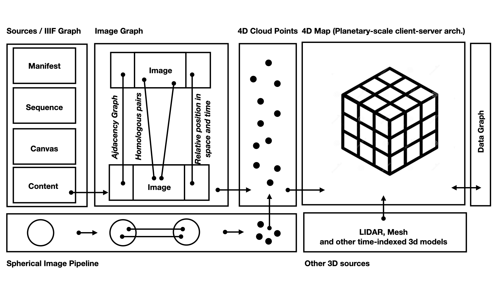

# Note on RFC on 4D Map

## Motivation

## Approach

Concepts
## Overview of the Architecture

The 4D Map can store both points, segments and meshes using a hierarchal 4D grid.  It is filled with several ingestion pipelines. 

The 4D Map can store both points, segments and meshes using a hierarchal 4D grid.  It is filled with several ingestion pipelines. 
The Photogrammetric ingestion pipeline is composed of three components
* The Source Graph using the IIIF formalism. In the IIIF formalism, Images are described as annotations on Canvas. Canvas themselves are organised in sequences are part of Manifests. This formalism typically used for describing the structure and content of books or museum collections but it can be adapted to photogrammetric campaign. In this approach, Manifests corresponds to particular photographic surveys, 
* The Image Graph is connecting images that overlap points of view (and therefore same common feature points). The existence of an overlapping in space or time between two images is defined by the Adjacency graph. Pairs of homologous points and segments between images can be algorithmically computed or annotated manually. On the basis on the homologous pairs, an algorithm the compute the relative positon in space and time of two images as a combination of translation and rotation. 
* A 4D Cloud Point can be computed out of any connected components of the Image Graph. The first phase consists in computing only the odometry and the position of the homologous points. In a second phase, the model is densified. Such a model is rapidly too big to be displayed and manipulated on a desktop computer. For this reason it must be ingested in the client-sever architecture of the 4D map.

The ingestion in the 4D map is done by geoaligning the 4D Cloud Point into the coordinate system of the 4D map. This can be done is manual or automatic ways. Once in the 4D map the model is divided into hierarchical spatiotemporal cubes. The client-server architecture permits to guarantee a continuous navigation experience just transmitting the necessary amount of information to the client depending on its spatiotemporal point of view of the map. 
Other ingestion pipelines exist 
* The Spherical Image pipeline follows similar steps as the standard Image Photogrammetry pipeline 
* The Lidar and Mesh ingestion pipelines directly ingest their data in the 4D map. 
* Extraction of 3D information from videos is done through the standard Image Photogrammetric Pipeline (although a dedicated pipeline could also be envisioned)

## Implementation

### Critical Zone

Epiderm of the Earth : +/- 10 km 

## Client-server approach

## Question and Answers 

## Linked RFCs

